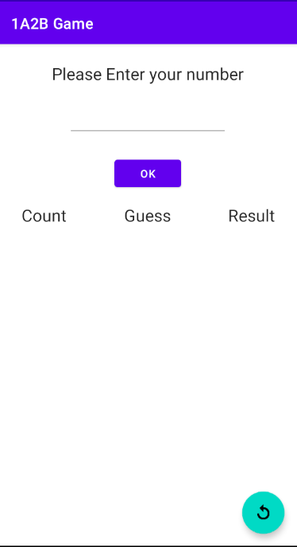
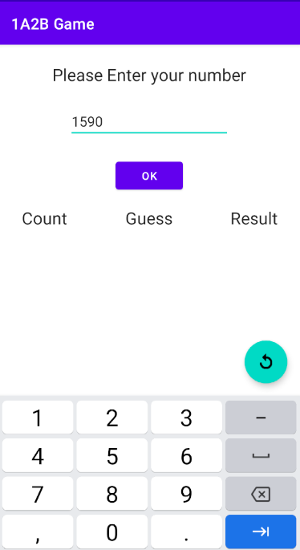
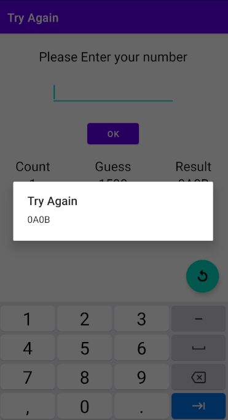
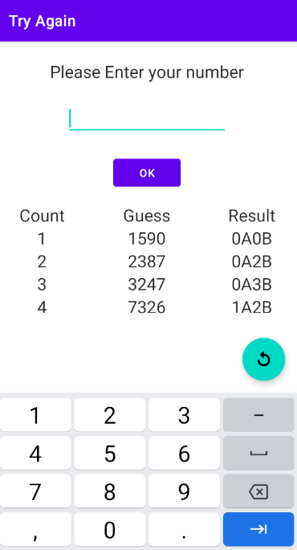

# GuessFourDigitsGame
Android side project in Kotlin

### Discription
遊戲會隨機產生一組不重複的四位數字([0-9]{4})，玩家必須輸入四個數字進行猜測，每猜一次，提示會以xAyB格式呈現，A代表數字正確且位置正確；B代表數字正確，但位置不正確。
比如: 正確解答是8743，玩家輸入8312，輸出是1A1B，一直猜中答案，輸出為4A0B。

### Screenshot
遊戲開始畫面 

輸入四位數字 

按下ok按鈕，出現提示結果 

直到猜到答案，提示出現 4A0B，遊戲結束 

按下右下按鈕，重新開始遊戲 

### HIstory
- 2021-08-23: 基本功能完成
