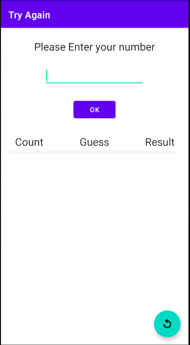

# GuessFourDigitsGame
Android side project in Kotlin

### Discription
遊戲會隨機產生一組不重複的四位數字([0-9]{4})，玩家必須輸入四個數字進行猜測，每猜一次，提示會以xAyB格式呈現，A代表數字正確且位置正確；B代表數字正確，但位置不正確。
比如: 正確解答是8743，玩家輸入8312，輸出是1A1B，一直猜中答案，輸出為4A0B。

### What I learn in this side project
- Viewbinding
- Adapter, RecyclerView
- Intent
- Room
- Save instance state method

### Screenshot
主畫面 

遊戲開始畫面 

輸入四位數字 

直到猜到答案，提示出現 4A0B，遊戲結束 

顯示猜題排行榜 

按下右下按鈕，重新開始遊戲 

### HIstory
- 2021-08-23: 基本功能完成
- 2021-08-24: 增加記錄猜題者排行榜功能，新增 Room 資料庫模組
- 2021-08-30: 新增主畫面，增加畫面旋轉儲存狀態機制
